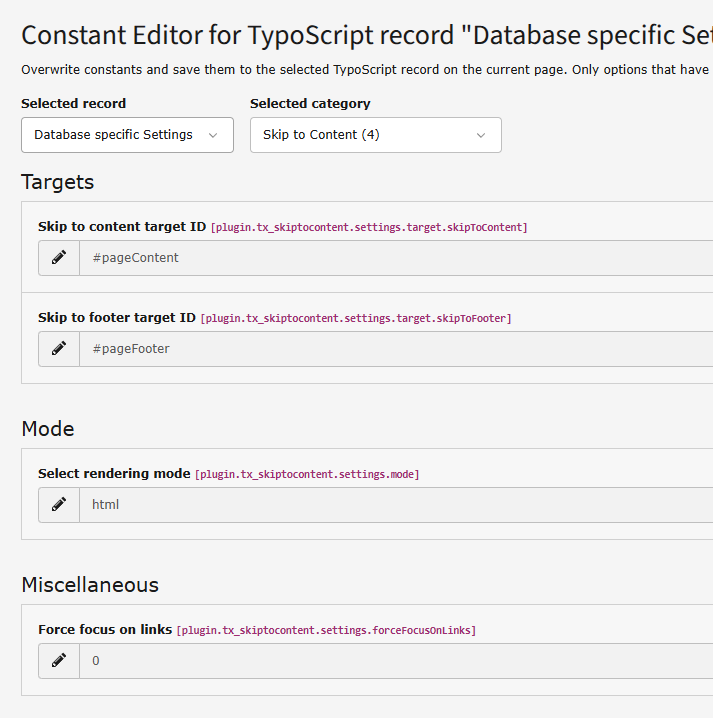

# Skip to content Extension for TYPO3 CMS
This plugin embeds the accessibility features to jump to the main content or page footer. Those links are initially invisibile and gets visible on focus via keyboard tab.

## Installation
**1a. Install via composer**
```bash
composer req wacon/wacon/skip-to-content
```

**1b. Install legacy mode**
[TYPO3 Extension Manager](https://docs.typo3.org/m/typo3/reference-coreapi/main/en-us/Administration/ExtensionManagement/ClassicMode/Index.html#extension-install)TYPO3 Extension Manager.

**2a. Add TypoScript Record to your template**
Assign the TypoScript static file: **Skip To Content (Add after your Site Package)** to your [root template](https://docs.typo3.org/m/typo3/tutorial-templating/7.6/en-us/Tasks/WorkingTypoScript/TypoScriptTemplate/Index.html).

**2b. TypoScript constants**
Adjust the settings via .
